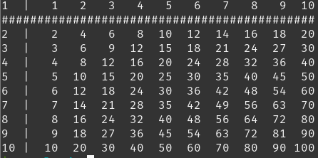

# Table of Contents
* [Chapter 1: Basics](#chapter-1-basics)
* [Chapter 2: Data Processing](#chapter-2-data-processing)
* [Chapter 3: Neural Networks](#chapter-3:-neural-networks)
* [Chapter 4: Convolutional Neural Networks](#chapter-4:-convolutional-neural-networks)
* [Chapter 5: Understanding Convolutional Neural Networks](#chapter-5:-understanding-convolutional-neural-networks)
* [Chapter 6: Recurrent Neural Networks](#chapter-6:-recurrent-neural-networks)
* [Chapter 7: Generative Models](#chapter-7:-recurrent-neural-networks)
* [Chapter 8: Security](#chapter-8:-security)

# Chapter 1: Basics
### The following 5 questions are just to warm you up in programmin with Python.

### Q.1: FizzBuzz
Write a program that prints the numbers from 1 to 100. But for multiples of three print “Fizz” instead of the number and for the multiples of five print “Buzz”. For numbers which are multiples of both three and five print “FizzBuzz”.

### Q.2: Quick Sort
Implement a quick sort (divide-and-conquer) algorithm. You can read about it
[here](https://en.wikipedia.org/wiki/Quicksort#:~:text=Quicksort%20is%20a%20divide%2Dand,sometimes%20called%20partition%2Dexchange%20sort.).

Sample Input: [9, 8, 7, 5, 6, 3, 1, 2, 4]

Sample Output: [1, 2, 3, 4, 5, 6, 7, 8, 9]

### Q.3: Missing Element
You are given two arrays. One is a shuffled version of another one, but missing
one element. Write a program to find a missing element.

Sample Input: [2, 3, 4, 5, 6, 7, 5, 8], [6, 8, 7, 4, 5, 2, 3]

Sample Output: 5

### Q.4: Pair Sum
You are given an array. Write a program to output all possible pairs that sum to
a specific value **k**.

Sample Input: [1, 3, 2, 2], **k** = 4

Sample Output: (1, 3) (2, 2)

### Q.5: Multiplication Table
Write a program that outputs a multiplication table like the following picture.



### The following 5 questions are for NumPy. If you have used MATLAB, you will be just fine.
The question are extracted from [numpy-100](https://github.com/rougier/numpy-100/blob/master/100_Numpy_exercises.ipynb) and you can practise more if you have time.

### Q.6: Create a checkerboard 8x8 matrix using the tile function.

### Q.7: Normalize a 5x5 random matrix.

### Q.8: Multiply a 5x3 matrix by a 3x2 matrix (real matrix product)

### Q.9: Given a 1D array, negate all elements which are between 3 and 8, in place.

### Q.10: Consider two random array A and B, check if they are equal.

# Chapter 2: Data Processing

Text can be **bold**, _italic_, or ~~strikethrough~~.

[Link to another page](./another-page.html).

text here

There should be whitespace between paragraphs.

There should be whitespace between paragraphs. We recommend including a README, or a file with information about your project.

# Header 1

This is a normal paragraph following a header. GitHub is a code hosting platform for version control and collaboration. It lets you and others work together on projects from anywhere.

## Header 2

> This is a blockquote following a header.
>
> When something is important enough, you do it even if the odds are not in your favor.

### Header 3

```js
// Javascript code with syntax highlighting.
var fun = function lang(l) {
  dateformat.i18n = require('./lang/' + l)
  return true;
}
```

```ruby
# Ruby code with syntax highlighting
GitHubPages::Dependencies.gems.each do |gem, version|
  s.add_dependency(gem, "= #{version}")
end
```

#### Header 4

*   This is an unordered list following a header.
*   This is an unordered list following a header.
*   This is an unordered list following a header.

##### Header 5

1.  This is an ordered list following a header.
2.  This is an ordered list following a header.
3.  This is an ordered list following a header.

###### Header 6

| head1        | head two          | three |
|:-------------|:------------------|:------|
| ok           | good swedish fish | nice  |
| out of stock | good and plenty   | nice  |
| ok           | good `oreos`      | hmm   |
| ok           | good `zoute` drop | yumm  |

### There's a horizontal rule below this.

* * *

### Here is an unordered list:

*   Item foo
*   Item bar
*   Item baz
*   Item zip

### And an ordered list:

1.  Item one
1.  Item two
1.  Item three
1.  Item four

### And a nested list:

- level 1 item
  - level 2 item
  - level 2 item
    - level 3 item
    - level 3 item
- level 1 item
  - level 2 item
  - level 2 item
  - level 2 item
- level 1 item
  - level 2 item
  - level 2 item
- level 1 item

### Small image


### Large image


### Definition lists can be used with HTML syntax.

<dl>
<dt>Name</dt>
<dd>Godzilla</dd>
<dt>Born</dt>
<dd>1952</dd>
<dt>Birthplace</dt>
<dd>Japan</dd>
<dt>Color</dt>
<dd>Green</dd>
</dl>

```
Long, single-line code blocks should not wrap. They should horizontally scroll if they are too long. This line should be long enough to demonstrate this.
```

```
The final element.
```
