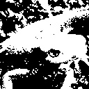
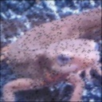

# Table of Contents
* [Chapter 1: Basics](#chapter-1-basics)
* [Chapter 2: Data Processing](#chapter-2-data-processing)
* [Chapter 3: Neural Networks](#chapter-3-neural-networks)
* [Chapter 4: Convolutional Neural Networks](#chapter-4-convolutional-neural-networks)
* [Chapter 5: Understanding Convolutional Neural Networks](#chapter-5-understanding-convolutional-neural-networks)
* [Chapter 6: Recurrent Neural Networks](#chapter-6-recurrent-neural-networks)
* [Chapter 7: Generative Models](#chapter-7-recurrent-neural-networks)
* [Chapter 8: Security](#chapter-8-security)

# Chapter 1: Basics
### The following 5 questions are just to warm you up in programming with Python.

### Q.1: FizzBuzz
Write a program that prints the numbers from 1 to 100. But for multiples of three print “Fizz” instead of the number and for the multiples of five print “Buzz”. For numbers which are multiples of both three and five print “FizzBuzz”.

### Q.2: Quick Sort
Implement a quick sort (divide-and-conquer) algorithm. You can read about it
[here](https://en.wikipedia.org/wiki/Quicksort#:~:text=Quicksort%20is%20a%20divide%2Dand,sometimes%20called%20partition%2Dexchange%20sort.).

Sample Input: [9, 8, 7, 5, 6, 3, 1, 2, 4]

Sample Output: [1, 2, 3, 4, 5, 6, 7, 8, 9]

### Q.3: Missing Element
You are given two arrays. One is a shuffled version of another one, but missing
one element. Write a program to find a missing element.

Sample Input: [2, 3, 4, 5, 6, 7, 5, 8], [6, 8, 7, 4, 5, 2, 3]

Sample Output: 5

### Q.4: Pair Sum
You are given an array. Write a program to output all possible pairs that sum to
a specific value **k**.

Sample Input: [1, 3, 2, 2], **k** = 4

Sample Output: (1, 3) (2, 2)

### Q.5: Multiplication Table
Write a program that outputs a multiplication table like the following picture.


The following 5 questions are for NumPy. If you have used MATLAB, you will be just fine.
The question are extracted from [numpy-100](https://github.com/rougier/numpy-100/blob/master/100_Numpy_exercises.ipynb) and you can practise more if you have time.

### Q.6
Create a checkerboard 8x8 matrix using the tile function.

### Q.7
Normalize a 5x5 random matrix.

### Q.8
Multiply a 5x3 matrix by a 3x2 matrix (real matrix product)

### Q.9
Given a 1D array, negate all elements which are between 3 and 8, in place.

### Q.10
Consider two random array A and B, check if they are equal.

# Chapter 2: Data Processing
In this chapter, we will do the first 10 [knocks of image processing](https://github.com/yoyoyo-yo/Gasyori100knock).
If you don't understand, please read the original image processing knocks which
are originally in Japanese.

### Q.1: Channel Swapping
Change the channel order from RGB -> BGR.

|Input|Output|
|:---:|:---:|
|||

### Q.2: Grayscale
Convert a color image to a grayscale one. The linear formula is

Y = 0.2126 R + 0.7152 G + 0.0722 B

|Input|Output|
|:---:|:---:|
|||

### Q.3: Binarization
Binarize an image given the threshold is 128.

|Input|Output|
|:---:|:---:|
|||

### Q.4: Binarization of Otsu
This is an automatic thresholding algorithm by minimizing intra-class intensity
variance or maximizing inter-class variance.

|Input|Output|
|:---:|:---:|
|||

### Q.5: HSV Conversion
RGB -> HSV and HSV -> RGV

In this case, invert the hue H (add 180) and display it as RGB and display the image.

|Input|Output|
|:---:|:---:|
|||

### Q.6: Discretization of Color
Quantize the image as follows.

```
val = {  32  (0 <= val < 63)
         96  (63 <= val < 127)
        160  (127 <= val < 191)
        224  (191 <= val < 256)
```

|Input|Output|
|:---:|:---:|
|||

### Q.7: Average Pooling
Perform an average pooling of 128x128 image by 8x8 kernel.

|Input|Output|
|:---:|:---:|
|||

### Q.8: Max Pooling
Perform a max pooling of 128x128 image by 8x8 kernel.

|Input|Output|
|:---:|:---:|
|||

### Q.9: Gaussian Filter
Implement the Gaussian filter (3 × 3, standard deviation 1.3) and remove the noise of a noisy image.

|Input|Output|
|:---:|:---:|
|||


### Q.10: Median Filter
Implement the median filter (3x3) and remove the noise of a noisy image.

|Input|Output|
|:---:|:---:|
|||


# Chapter 3: Neural Networks
### Q.1: Linear Regression
* Generate a synthetic dataset containing 1000 examples with addictive noise.
  Each sample consists of 2 features. The true parameter generating the dataset
  is $$w = [2, -3.4], b = 4.2$$. Sample noise from normal distribution with mean
  0 and standard deviation 0.01. Synthetic labels will be $$y = Xw^T + b + \epsilon$$.
  Plot the features, we can clearly see the linear correlation between features
  and labels.
* Build a model $$\hat{y} = Xw^T + b$$. The model will learn $$w$$ and $$b$$.
* Define a squared loss function.
* Initialize the model paremeters with random values drawn by normal
  distribution with mean 0 and standard deviation 0.01 and set the bias to 0.
* Use minibatch stochastic gradient descent to train the model.
* Print the errors between true parameters and learnt parameters.

### Q.2: Softmax Regression
* We will use Fashion-MNIST dataset with a batch size of 256 and build a single layer neural network.
* Initialize the model parameters with Gaussian noise (normal distribution with
  mean 0 and standard deviation 0.01) and set the bias to 0.
* Define the softmax operation.
* Define the model. The only difference from the previous question is to apply
  the softmax operation to the output because now we are dealing with
  a classification problem.
* Define a cross-entropy loss.
* Train the model with minibatch stochastic gradient descent and plot the
  learning curve.
* Calculate the accuracy of the model.

### Q.3: Multilayer Perceptrons
* We will build a neural network with a hidden layer (256 hidden units) and non-linear activation
  functions for Fashion-MNIST dataset.
* Initialize the model parameters with random values drawn from normal
  distribution.
* Define a model with ReLU activation function.
* We will use the same cross-entrop loss.
* Train the model with minibatch stochastic gradient descent and plot the
  learning curve.
* Calculate the accuracy of the model.

### Q.4: Regularization
We do not want the model to memorize the training data. We will use
generalization techniques to improve generalization of the model.
Implement the following reqularization techniques by using a synthetic dataset
or any dataset you like. Compare training with regularization and without
regularization.
* Dropout
* Early Stopping
* Weight decay (L-2 regularization)

